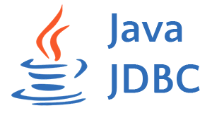

# Bootcamp Java Fullstack

### Iniciado el 17 julio 2024

Aquí estoy iniciando el camino para convertirme en un desarrollador full stack Java.

Estoy adquiriendo conocimientos y herramientas asociadas a este mundo de la
programación. Tengo conocimientos básicos esenciales y uno que otro proyecto, sin embargo, no
cuentan con las mejores prácticas de programación.

Espero con el tiempo y práctica lograr un dominio mayor y desenvolverme en este mercado
que avanza cada día con más y nuevas herramientas.

Dispongo de buena voluntad para ayudar con lo poco que sé y perseverancia para buscar soluciones.

## Aprendizajes durante el bootcamp

  
   
   
   
   

   
   
   
   
   

  
   

   
   
  

   
  

   
   

### 1. **Frontend Development**

- **HTML**: Estructura del contenido web.
- **CSS**: Estilo y diseño de las páginas web.
- **JavaScript**: Lenguaje de programación para interactividad y dinámica en el frontend.
- **Bootstrap**: Framework de CSS (y JavaScript) para diseño responsivo y rápido desarrollo de interfaces web.

### 2. **Backend Development**

  - **Java**: Lenguaje de programación usado en el backend para desarrollar aplicaciones robustas.
  - **POO (Programación Orientada a Objetos)**: Paradigma fundamental para modelar datos y comportamientos mediante objetos.
  - **Spring Boot**: Framework para el desarrollo rápido de aplicaciones Java basadas en Spring.

### 3. **Tecnologías Web en Java**

  - **Apache Tomcat**: Servidor web y contenedor de Servlets y JSP, para ejecutar aplicaciones web en Java.
  - **Servlets**: Componente Java que maneja peticiones HTTP en aplicaciones web.
  - **JSP (JavaServer Pages)**: Tecnología para crear páginas web dinámicas usando Java en el backend.

### 4. **Persistencia de Datos**

  - **SQL**: Lenguaje estándar para consultar y manipular bases de datos.
  - **PostgreSQL**: Sistema de gestión de bases de datos relacional que usa SQL.
  - **JDBC (Java Database Connectivity)**: API de Java para conectar aplicaciones con bases de datos.
  - **Hibernate**: Framework ORM para la gestión eficiente de bases de datos en Java.
  - **Spring Data JPA**: Extensión de Spring para acceso y manipulación de datos en aplicaciones Java.

### 5. **Control de Versiones**

  - **Git**: Sistema de control de versiones distribuido.
  - **GitHub**: Plataforma basada en Git para repositorios de código y colaboración en proyectos.

### 6. **Testing**

  - **JUnit**: Framework de pruebas unitarias para aplicaciones Java.
  - **Mockito**: Framework de simulación para pruebas unitarias en Java.
  - **Postman**: Herramienta para pruebas de APIs, facilitando la automatización y verificación de respuestas HTTP.

### 7. **Herramientas de Desarrollo**

  - **IntelliJ IDEA**: IDE avanzado para Java y otros lenguajes, compatible con sistemas de control de versiones y frameworks.
  - **VS Code**: Editor de código ligero y extensible, ideal para desarrollo web y de múltiples lenguajes.

### 8. **Arquitectura de Aplicaciones Java**

  - **API REST**: Arquitectura de servicios web, facilitando la comunicación entre aplicaciones a través de HTTP.
  - **Modelo MVC (Model-View-Controller)**: Patrón de diseño que separa la lógica de negocio, presentación y control, útil en aplicaciones web.
  - **Thymeleaf**: Motor de plantillas para renderizar HTML en aplicaciones Java, ideal para el desarrollo de vistas con Spring MVC.
